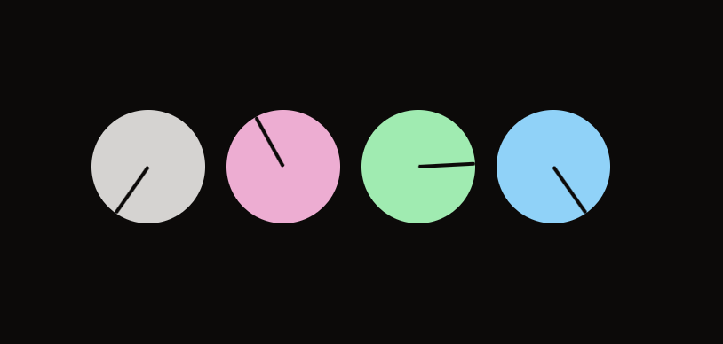

# 🎛️ React Knob Headless

[](https://npmjs.com/package/react-knob-headless)
[](https://react-knob-headless.vercel.app)

Unstyled & accessible **knob** primitive for React.

<a href="https://react-knob-headless.vercel.app" target="_blank"></a>

## Features

- Knob primitive component. Tailored for audio applications in React.
- Unstyled. Can be styled with any styling solution: Vanilla CSS, Tailwind, Emotion, anything.
- Smooth drag gesture, which supports mouse & touch devices. Powered by [@use-gesture](https://use-gesture.netlify.app/).
- Accessibility support. Follows [ARIA Slider](https://www.w3.org/WAI/ARIA/apg/patterns/slider/) pattern.

## Documentation

📚 **[react-knob-headless.vercel.app](https://react-knob-headless.vercel.app/)**

## Installation

```sh
npm install --save-exact react-knob-headless
```
